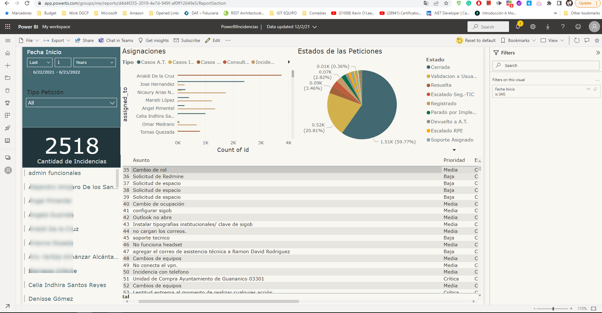
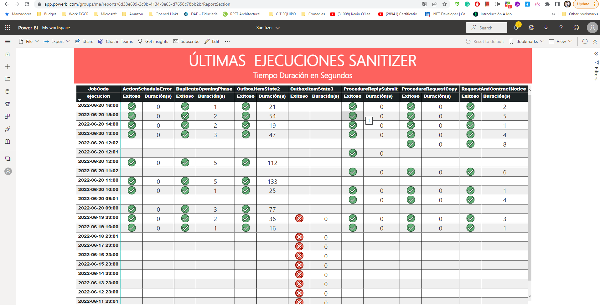
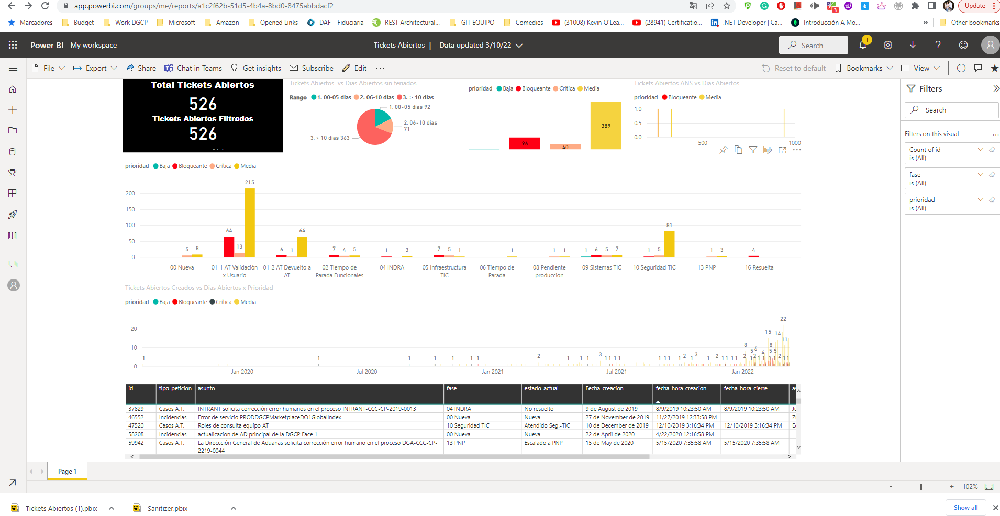
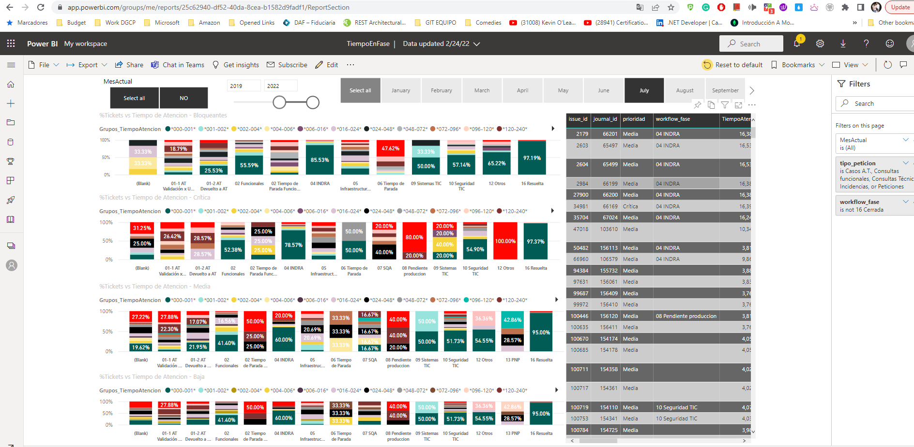
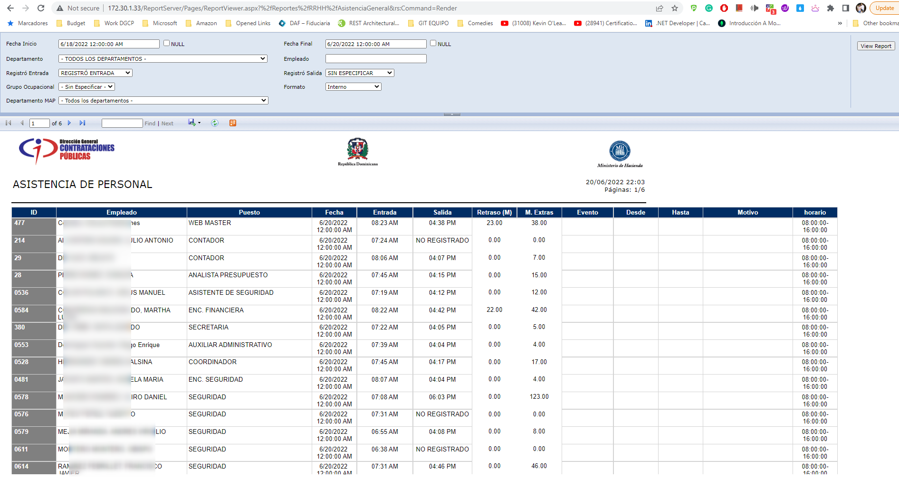
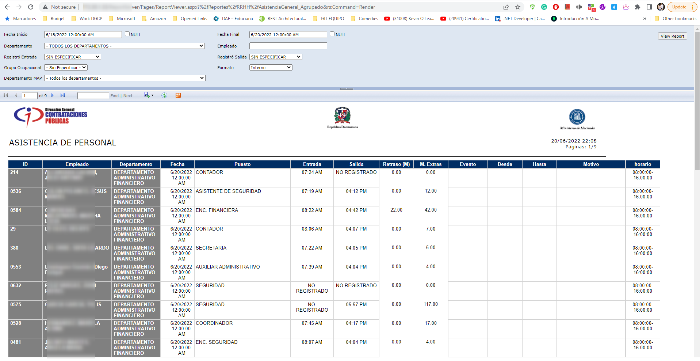

# Develop and maintain SQL Server Reporting Services (SSRS) and Power BI Reports

The goal was to develop and maintain SQL Server Reporting Services (SSRS) and Power BI Reports according to the request of internal users.

Technology used:
**SQL Server Reporting Services (SSRS) and Power BI
MS SQL Server, Mysql, T-SQL (Store procedure, functions, view, temporary tables, linked servers, etc)**

I have developed and maintained reports such as the following:

Reports in powerBI to show assistance issued by techniques to users, reports of emergency processes of the portal system, and reports of database processes, among others.

Reports in Reporting Services to show staff attendance, Number of employees report, Grouped list of attendance per month, and Purchase indicator reports, among others.

##### Screenshots of the Power BI

##### Screenshots of the SSRS

